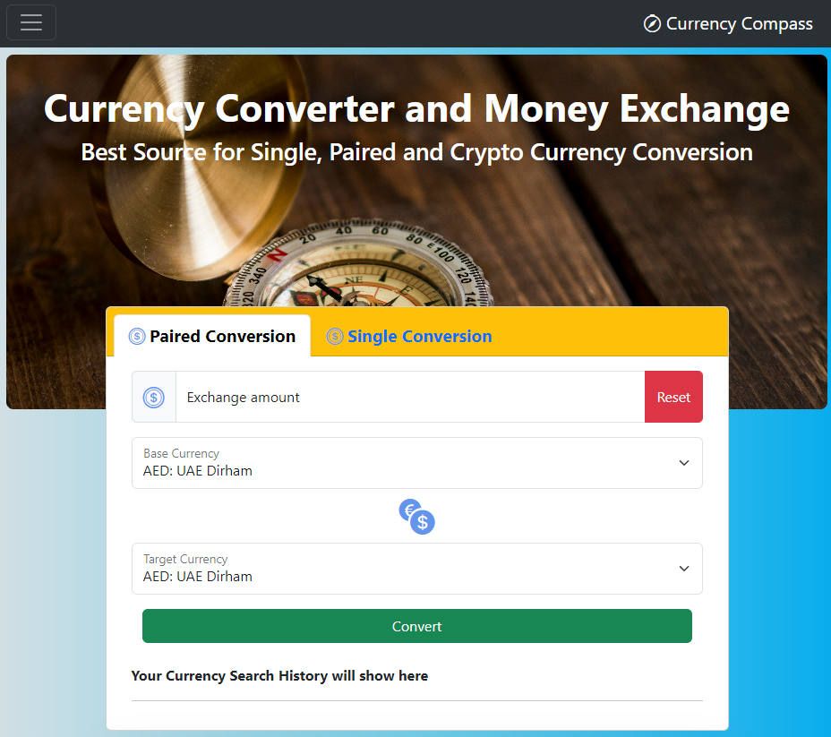

# Group-3-Project-1
Bootcamp project 1. AGILE group project.

Contibutors

Dominic Paul
Khubaib Shah
Chersilnt (Billy) Ntervisi
Yaroslav Bozhak
Julio Cesar Marcondes

-   As a team we have created a currency conversion application.

-   We wanted a simple and intuitive application to convert from standard 
    currencies and also crypto currencies.

-   As a user interested in international finance, I want a currency    conversion app that not only facilitates quick and accurate conversions but also provides me with the ability to convert between fiat and crypto currencies. This integrated feature will help me make informed decisions based on both financial data regardless of where my money is held.

Breakdown of roles and tasks:

    Project Manager

 - Responsible for overseeing project timeline - deadlines - communication - coordination.

    HTML & CSS & JavaScript
 - Everyone took part in the code development. Tasks/tickets were assigned to each one by the PM.

    API Integration

- The API Integration took some time due to having to find a suitable API for the application, I.E enough requests and data structure

    Quality Assurance

Within the Kanban board within GitHub project all tickets needed to pass through test before going into PROD.

Acceptance Criteria 

Application uses at least two server-side APIsLinks to an external site..

Application uses client-side storage to store persistent data.

Application doesn't use JS alerts, prompts, or confirms (uses modals instead).

Application uses Bootstrap.

Application is interactive (accepts and responds to user input).

We have satisfied all of the above.

Screen shots of the application can be seen below:

Live Page:

https://dpaul93.github.io/Group-3-Project-1/

GitHub Repository 

https://github.com/dpaul93/Group-3-Project-1